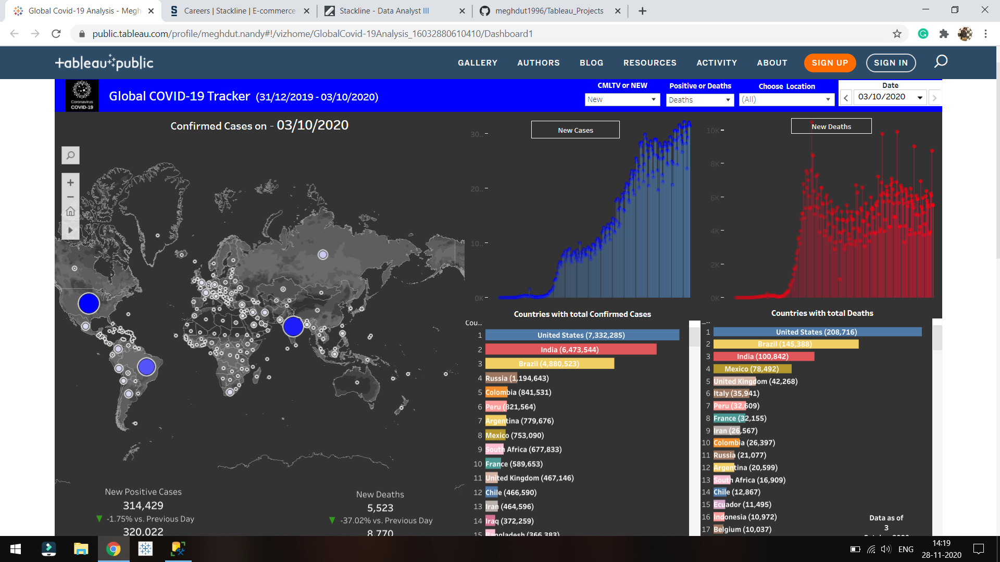

# Global Covid-19 Analysis using Tableau Desktop

DashBoard Link :- https://lnkd.in/eAUfXrE

The Requirement of the business problem to showing the spread of Covid-19 cases all over the world using tableau desktop, data gathered from the spark foundation, stored it in SQL server database, using animation, timeline & annotations by creating attractive & interactive dashboard & story with interesting patterns and a possible reason helping Covid-19 spread with basic & advanced charts and published the dashboard in Tableau Public.

